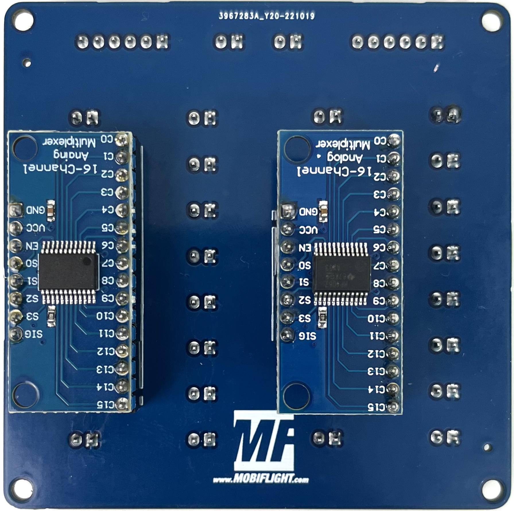
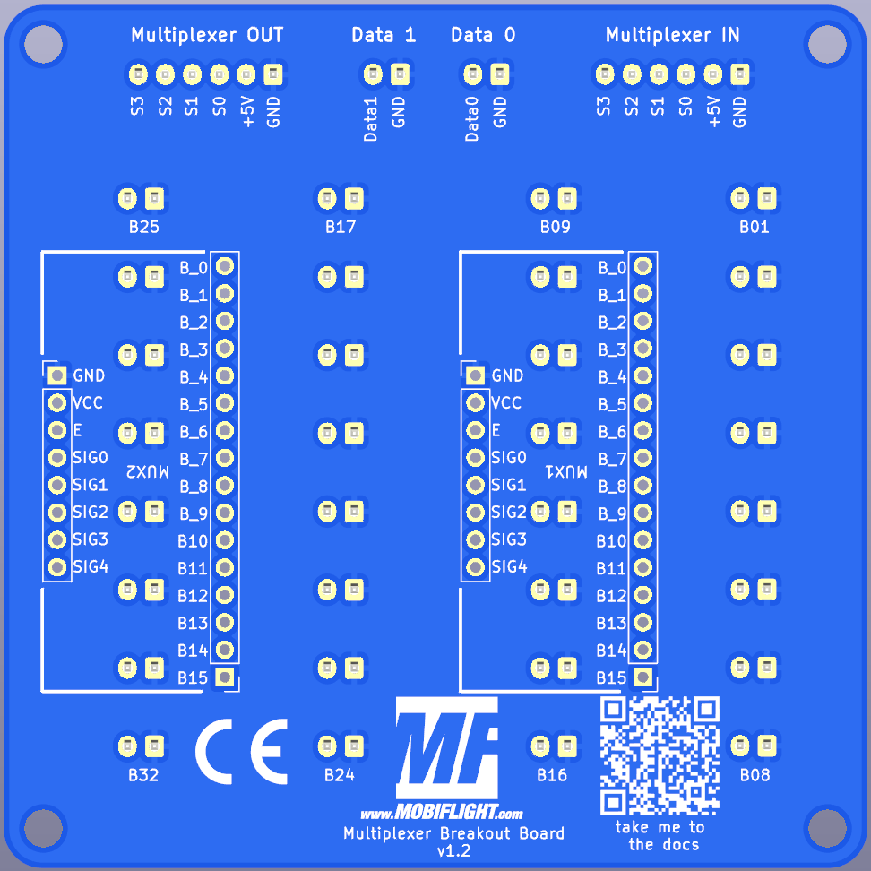
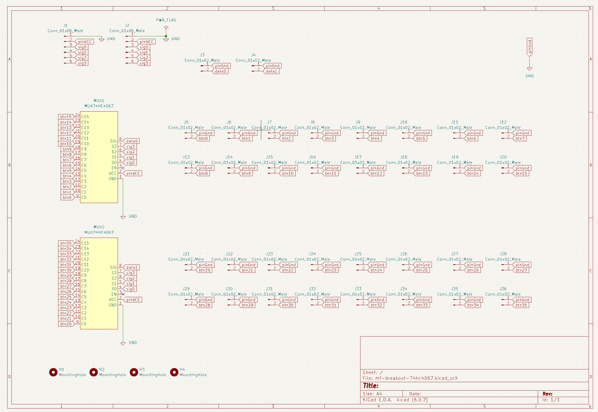

# MobiFlight Multiplexer Breakout Board
The MobiFlight Multiplexer Breakout Board is a breakout board for easier use of the 74HC4067 multiplexer.

On the top side, The board uses XH JST connectors for the individual inputs. On the back, you can add up to two 74HC4067 modules (https://shop.mobiflight.com/product/multiplexer).

On the bottom side, you plug in the 74HC4067 modules. Version 1.2 now shows information about the orientation and all important pins are labeled.
You can daisy chain the boards.

For more information on how to configure the board with MobiFlight, check out the [MobiFlight Connector documentation](https://github.com/MobiFlight/MobiFlight-Connector/wiki/Input-and-Output-devices#input-multiplexer).

## Board overview

### Multiplexer IN
Connection coming from your Mobiflight board, or another MobiFlight Multiplexer Breakout Board as daisy chain.

* Pin1 - GND
* Pin2 - VCC
* Pin3 - Channel 1
* Pin4 - Channel 2
* Pin5 - Channel 3
* Pin6 - Channel 4

### Data 0
Connection coming from your Mobiflight board.

* Pin1 - GND
* Pin2 - Signal pin (for the first 74HC4067)

### Data 1
Connection coming from your Mobiflight board.

* Pin1 - GND
* Pin2 - Signal pin (for the second 74HC4067)

### Multiplexer OUT
Connection to daisy chain another MobiFlight Multiplexer Breakout Board.

* Pin1 - GND
* Pin2 - VCC
* Pin3 - Channel 1
* Pin4 - Channel 2
* Pin5 - Channel 3
* Pin6 - Channel 4

### Button01-08
First row of connectors for input devices buttons and switches:

* Pin1 - Connection TO switch
* Pin2 - Connection FROM switch

Polarity doesn't matter for switches.

### Button09-16
Second row of connectors for input devices buttons and switches:

* Pin1 - Connection TO switch
* Pin2 - Connection FROM switch

Polarity doesn't matter for switches.

### Button 17-24
First row of connectors for input devices buttons and switches:

* Pin1 - Connection TO switch
* Pin2 - Connection FROM switch

Polarity doesn't matter for switches.

### Button 25-32
Second row of connectors for input devices buttons and switches:

* Pin1 - Connection TO switch
* Pin2 - Connection FROM switch

Polarity doesn't matter for switches.

## Mounting of 74HC4067 modules

As one can see on the picture, the 74HC4067 are mounted with the silkscreen facing up. Due to the asymmetric connectors, the orientation cannot be confused.

## MobiFlight Configuration

> This information will be added soon.

## Case
You can print a case for the board [using this STL file](breakout-multiplexer-case.stl) for better handling and look:

## Additional information

### Bottom side

### Schematic

